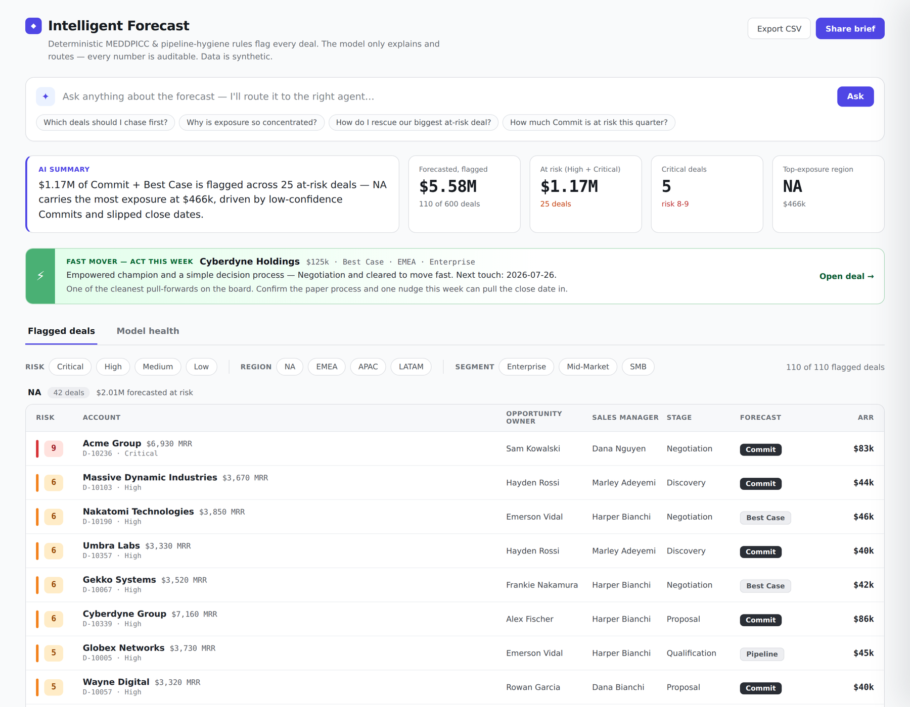
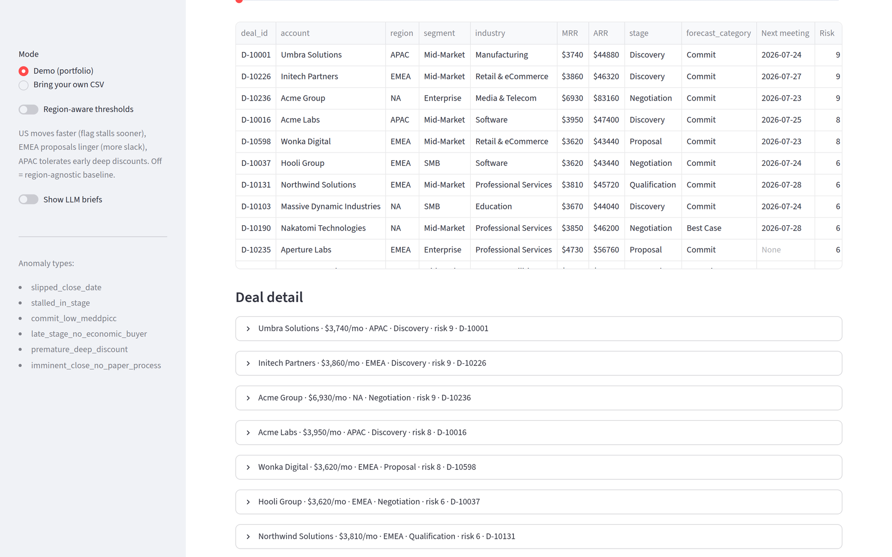

# Intelligent Forecast


An executive-facing **forecast-risk dashboard** for a B2B SaaS pipeline. It reads
a pipeline export, applies **deterministic rules grounded in MEDDPICC** and
deal-hygiene, and surfaces *which committed / best-case deals are at risk, and
why* — money at risk (ARR) up top, a region-grouped deal list with risk bands, a
click-to-open detail drawer, and an "Ask anything" bar that routes questions to
one of four agents. The **human-in-the-loop** split is the whole point: the
deterministic rules own every flag and risk score; the model only explains and
routes. Every number is auditable — a sales manager can read any flag and verify
it against the CRM record. All data is synthetic.

**Stack:** React + Vite · FastAPI · Python · pandas · Model Context Protocol
(MCP) · Anthropic SDK · Docker · pytest / ruff / black.

**What it demonstrates:** a deterministic, fully-tested rule engine with a real
evaluation harness (precision / recall / F1 vs. labeled ground truth); a FastAPI
service + React SPA deployable as one container; an MCP tool server and a
multi-agent layer (per-region bookings forecasting, a deal/region "sales guru",
and the dashboard's agent bar); and a disciplined design where the rules decide
and the LLM only explains — so every flag is auditable.



*The web dashboard (`make api` + `make web-build`, or `docker run`): money at
risk up top, an agent bar that routes to four RevOps agents, a Fast Mover upside
alert, and the region-grouped flagged-deal list — each row opening a detail
drawer with the flagging reason and recommended step. Deploy it anywhere with
Docker (see [`DEPLOY.md`](DEPLOY.md)); set `ANTHROPIC_API_KEY` for LLM-backed
agent answers, or run it fully offline.*

## Eval scorecard

The bundled dataset (`data/pipeline.csv`, 600 deals, seed 28) models a real B2B
SaaS book: **MRR-based pricing that scales with company size** ($3,250 floor,
~$4,050 blended ASP, larger accounts buy higher MRR — up to the ~$10K+ deals that
run longer and are less predictable), **firmographics** (industry, employees,
account revenue), a **decision profile** (champion seniority + approval
complexity), and **regional behavior** — US deals move fast, EMEA deals run long
and linger in Proposal, APAC discounts early as normal practice. Anomalies are
labeled relative to each region's norm, so the detector is scored two ways
(`make eval` / `make eval-region`):

| Metric | Region-agnostic (one global norm) | **Region-aware (each region's norm)** |
| --- | --- | --- |
| Precision | 0.736 | **0.922** |
| Recall | 0.964 | **0.988** |
| **F1** | **0.835** | **0.954** |
| Confusion (TP/FP/FN/TN) | 81 / 29 / 3 / 487 | 83 / 7 / 1 / 509 |

Region-aware scoring recovers **+11.9 F1 points** — the two region-sensitive
rules tell the story:

| Rule (region-aware) | Precision | Recall | vs agnostic |
| --- | --- | --- | --- |
| slipped_close_date | 1.000 | 1.000 | — |
| **stalled_in_stage** | **1.000** | **1.000** | agnostic 0.542 / 0.684 |
| commit_low_meddpicc | 0.714 | 0.909 | region-independent |
| late_stage_no_economic_buyer | 0.857 | 1.000 | region-independent |
| **premature_deep_discount** | **0.600** | 1.000 | agnostic 0.300 prec |
| imminent_close_no_paper_process | 0.909 | 0.952 | — |

**Reading the numbers, honestly** (full before/after in [`TUNING.md`](TUNING.md)):

- **`stalled_in_stage`:** the global norm over-flags EMEA's normally-long
  proposals *and* misses NA's fast-region stalls; judging against each region's
  own norm fixes both (0.54/0.68 → 1.00/1.00).
- **`premature_deep_discount`:** region-aware stops false-flagging APAC's normal
  early discounts (0.30 → 0.60 precision). The residual false positives are
  natural 40% catalog discounts in other regions — feature-identical to the real
  ones, so we flag them honestly rather than overfit.
- **`commit_low_meddpicc` (0.71/0.91) / `late_stage_no_economic_buyer` (0.86/1.00)**
  carry some realistic co-injection overlap and are region-independent (identical
  in both modes).

_(Numbers regenerate with the dataset; `make data && make eval` to refresh.)_

## Quickstart

```bash
# 1. Install deps
pip install -r requirements.txt

# 2. (optional) regenerate the labeled dataset — it's already committed
make data       # python generate_forecast_data.py --n 600 --seed 28 --out data/pipeline.csv

# 3. Run the deterministic-core unit tests
make test       # pytest -q

# 4. One-command offline walkthrough (no API key): scorecard -> deal coaching ->
#    VP worklist -> signals -> region forecast, all deterministic
make demo       # python demo.py  (Windows: python demo.py)

# 5. Print the eval scorecard against the bundled labeled CSV
make eval       # python -m detector.evaluate data/pipeline.csv

# 6. Launch the two-mode Streamlit UI
make app        # streamlit run app.py

# 7. Run the MCP server so an agent can query the pipeline (see "Agent / MCP")
make mcp        # python mcp_server.py
```

The core (`rules`, `engine`, `evaluate`) makes **zero network calls** and runs
end to end with no API key. Only the optional LLM paths (`detector/narrative.py`,
the agents, and the dashboard's agent bar) touch the Anthropic API; set
`ANTHROPIC_API_KEY` to enable them, or leave it unset and they degrade gracefully.

## Web dashboard (Intelligent Forecast)

The primary product is a **React + Vite** single-page dashboard served by a
**FastAPI** backend (`api/`) that reuses the detector — the two deploy as **one
container**. The API is read-only:

- `GET /api/forecast` — flagged deals (with owner / manager / MRR / ARR, and each
  firing rule's reason + recommended step), KPI tiles, the AI summary line, the
  model-health scorecard, and the Fast Mover banner.
- `POST /api/ask` — routes a natural-language question to one of four agents
  (Risk Triage, Forecast Explainer, Pipeline Analyst, Deal Rescue Planner) and
  answers from the real data; uses the LLM when `ANTHROPIC_API_KEY` is set,
  otherwise a deterministic answer.

```bash
# Local dev (hot reload): API on :8000, SPA on :5173 (Vite proxies /api)
make api            # terminal 1 — uvicorn api.server:app --reload
make web            # terminal 2 — cd web && npm install && npm run dev

# Production-style: build the SPA so FastAPI serves it at :8000
make web-build && make api        # open http://localhost:8000

# One deployable container (deploy to Render / Fly / Railway / any Docker host)
make docker                       # docker build -t intelligent-forecast .
docker run -p 8000:8000 -e ANTHROPIC_API_KEY=sk-... intelligent-forecast
```

Full deployment guide (env vars, managed hosts): [`DEPLOY.md`](DEPLOY.md). The
dashboard works fully **without** a key — the agent bar just falls back to
deterministic answers. A lightweight **Streamlit** view (`make app`) is kept as
a secondary/portfolio UI (see [The UI](#the-ui)).

## How the rules map to MEDDPICC

Each rule maps 1:1 to a ground-truth `anomaly_types` id and to the MEDDPICC (and
deal-hygiene) signal it watches. Adding a new anomaly type is a one-function
change in `detector/rules.py` plus one line in the `ALL_RULES` registry.

| Rule (`rule_id`) | MEDDPICC / hygiene signal | Fires when | Severity |
| --- | --- | --- | --- |
| `slipped_close_date` | Deal hygiene (forecast discipline) | `close_date_pushes ≥ 2` | medium → high (3+) |
| `stalled_in_stage` | Decision **P**rocess velocity | open & `days_in_stage > normal × 2.5` | medium → high (>4×) |
| `commit_low_meddpicc` | Overall MEDDPICC confidence | `forecast = Commit` & `confidence < 60` | high |
| `late_stage_no_economic_buyer` | **E**conomic Buyer | Proposal/Negotiation & `m_economic_buyer = 0` | high |
| `premature_deep_discount` | **M**etrics / Identified **P**ain (value unproven) | early stage & `discount ≥ 30%` | medium |
| `imminent_close_no_paper_process` | **P**aper Process | open & `days_to_close ≤ 7` & `m_paper_process = 0` | high |

All thresholds live in `config.py` so a RevOps admin can retune the detector
without touching rule logic.

## Architecture

```
sales_forecast/
├── generate_forecast_data.py   # synthetic labeled pipeline (region-aware behavior)
├── generate_history.py         # synthetic historical bookings + forward targets
├── data/
│   ├── pipeline.csv            # labeled deals: MRR/ARR, firmographics, MEDDPICC, region, owner + sales manager, next_meeting_date
│   ├── history.csv             # 36 months of actual bookings + quota per region
│   └── targets.csv             # current + forward quotas per region
├── config.py                   # every tunable threshold (+ win-rates/haircut)
├── periods.py                  # time bucketing, history rollups, MoM/QoQ/YoY
├── detector/
│   ├── rules.py                # pure anomaly rules + ALL_RULES registry
│   ├── signals.py              # non-anomaly signals (fast movers / complex deals)
│   ├── plays.py                # deterministic playbook: rule hit → recommended play
│   ├── engine.py               # run rules + signals over a DataFrame → columns
│   ├── evaluate.py             # score vs. ground truth; scorecard_markdown()
│   └── narrative.py            # optional, offline-safe LLM briefs
├── agents/                     # estimation + coaching layer (over the MCP tools)
│   ├── baseline.py             # deterministic risk-adjusted expected-bookings
│   ├── mcp_client.py           # stdio client + Anthropic tool bridge
│   ├── attainment.py           # one agent per region + portfolio roll-up
│   └── sales_guru.py           # coach a deal / prioritize a region's VP worklist
├── api/                        # FastAPI backend for the web dashboard
│   ├── forecast.py             # shape the scored pipeline into the UI payload
│   ├── agents_web.py           # agent-bar routing + answers (deterministic / LLM)
│   └── server.py               # FastAPI app: JSON API + serves the built SPA
├── web/                        # React + Vite dashboard (the Intelligent Forecast UI)
│   ├── index.html · vite.config.js · package.json
│   └── src/                    # App.jsx, tokens.js, api.js, components/*
├── tests/
│   ├── test_rules.py           # a firing row + a clean row per rule
│   ├── test_signals.py         # fast-mover / complex-deal signal classifiers
│   ├── test_plays.py           # deterministic playbook (hit → play mapping)
│   ├── test_mcp_tools.py       # each MCP tool called directly
│   ├── test_periods.py         # period math, history rollups, comparisons
│   ├── test_agents.py          # baseline math + stdio round-trip + agent loop
│   ├── test_sales_guru.py      # guru fallbacks + deal/region agent loops
│   └── test_api.py             # forecast payload + agent routing + endpoints
├── app.py                      # Streamlit two-mode UI (secondary/portfolio view)
├── mcp_server.py               # FastMCP server exposing the detector to agents
├── demo.py                     # one-command offline walkthrough (make demo)
├── Dockerfile · DEPLOY.md      # one-container build + deployment guide
├── EXAMPLES.md                 # agent questions → tool calls
└── Makefile
```

- **`rules.py`** — one pure `def rule_x(row: dict) -> RuleHit | None` per anomaly.
  Every `reason` is built only from the row's own values.
- **`engine.py`** — `run(df)` applies all rules to every row and appends `hits`,
  `risk_score`, `predicted_anomaly`, and `top_reason` without dropping any rows.
- **`evaluate.py`** — overall precision/recall/F1 + confusion, plus per-rule
  precision/recall against `anomaly_types`. Labels are read here only, never in
  the rules.
- **`narrative.py`** — presentation only; returns `""` with no key so the
  pipeline is offline by default. Never imported by the deterministic core.
- **`mcp_server.py`** — read-only MCP tools that wrap `engine`/`evaluate` so an
  agent can query the pipeline conversationally. Zero LLM calls in any tool.

## The Streamlit view (secondary)

Alongside the primary [web dashboard](#web-dashboard-intelligent-forecast), a
lightweight Streamlit app is kept for quick data exploration and "bring your own
CSV" — `make app` opens a two-mode Streamlit app:

- **Demo (portfolio):** scores the bundled labeled CSV, shows the eval scorecard
  up top (so a reviewer immediately sees it works against ground truth), then a
  sortable/filterable table of flagged deals (filter by **region**, segment,
  stage, and min risk) with a per-deal detail expander.
- **Bring your own CSV:** runs the identical pipeline on an uploaded file (same
  schema; labels optional — the scorecard hides itself when labels are absent).

LLM briefs sit behind a per-deal toggle, so the app is fully usable without a key.
Each flagged deal's expander also lists its **recommended plays** (from
`detector/plays.py`) — the concrete moves to remove each flag. A **Deal signals**
section surfaces fast movers and complex deals (below).



*Flagged deals read the way reps think — company and MRR, opportunity owner and
their sales manager, stage, next-meeting date (or "None" when nothing's booked),
and a risk score — each expandable to its rule hits, signals, and recommended
plays. Owners and managers are a region-disjoint org (no name repeats across
regions), so a VP can delegate a play straight to the right managers.*

## Deal signals (opportunities, not just risk)

The anomaly rules flag *risk*. `detector/signals.py` adds the other half —
deterministic, non-anomaly classifiers driven by **champion seniority** and
**decision-process complexity** (`champion_seniority`, `approval_layers`,
`csuite_approval` in the data):

| Signal | Kind | Fires when |
| --- | --- | --- |
| **`fast_mover`** | opportunity | Champion is **Director+** *and* the process is **simple** (≤1 approval layer, no C-suite gate) — likely to close quickly |
| **`complex_deal`** | risk / duration | **C-suite** sign-off *or* **≥3** approval layers — expect a longer, less predictable cycle (the data reflects it: these run longer) |
| **`meeting_at_risk`** | risk / cadence | Next meeting is **more than a week out** (`NEXT_MEETING_MAX_DAYS`) *or* **none is booked** — momentum is slipping; run a **value touch** to pull a sooner next step in |

Signals aren't scored against `is_anomaly` (a fast mover is *good*, and
`meeting_at_risk` fires on ~40% of open deals — far too broad to be a scored
anomaly) — they're deterministic derivations surfaced for triage. `engine.run`
adds `signals`, `fast_mover`, `complex_deal`, and `meeting_at_risk` columns; the
UI shows counts + tables and per-deal badges; and the MCP layer exposes them
(`signals_summary`, `list_deals(signal="meeting_at_risk")`, and `assess_deal`'s
`decision_profile` + `signals`). `meeting_at_risk` maps to a **value-touch play**,
so it shows up in `recommend_plays` and the regional worklist alongside the
anomaly plays. Thresholds live in `config.py`.

### Region-aware thresholds (opt-in)

Regions run their sales motion differently, and the demo data is generated to
match. The sidebar **Region-aware thresholds** toggle judges each deal against
its region's own norms (all tunable in `config.py`):

| Region | Behavior (baked into the data) | Effect on rules |
| --- | --- | --- |
| **NA (US)** | Deals move fast (short time-in-stage) | `stalled_in_stage` uses NA's short norm → catches fast-region stalls the global norm misses |
| **EMEA** | Deals run long; proposals linger (~70-day norm) | `stalled_in_stage` uses EMEA's long norm → stops over-flagging normal long proposals |
| **APAC** | Early deep discounts are normal practice | `premature_deep_discount` is suppressed |

Because the labels are region-relative, region-aware scoring **materially
outperforms** the naive one-global-norm detector: **F1 0.835 → 0.954** (see the
scorecard above and [`TUNING.md`](TUNING.md)). It's **off by default** for
backward-compatible reproducibility; enable it via the UI toggle,
`engine.run(df, region_aware=True)`, `make eval-region`, or the `region_aware`
param on the MCP tools / `--region-aware` on the agent CLI. Rules stay pure
functions of a row — the flag rides in on the row dict.

## Agent / MCP

`mcp_server.py` exposes the deterministic detector as an [MCP](https://modelcontextprotocol.io)
server so any MCP client (Claude Desktop, Claude Code, a custom agent) can ask
the pipeline questions — regional roll-ups, single-deal risk, shaky-Commit
exposure — and get **structured JSON back**. The agent narrates; the rules still
own every flag. It's read-only and makes zero LLM calls. The dataset is loaded
and scored once at startup; point it at your own export via `FORECAST_CSV`.

**Risk tools:** `list_deals`, `assess_deal`, `assess_segment`, `assess_region`,
`forecast_summary`, `get_scorecard`, `list_regions`, `list_segments`,
`list_industries`, `signals_summary`.
**Play / action tools:** `recommend_plays` (deterministic plays to de-risk one
deal), `region_top_actions` (a regional VP's top-N prioritized actions across the
active pipeline — one play per action, may cover several deals, ranked by
ARR-at-stake × urgency).
**Time / bookings tools:** `bookings_rollup` (current month/quarter projection +
attainment), `pipeline_by_period` (bookings distribution across periods),
`bookings_history` (actuals by period), `period_comparison` (MoM/QoQ/YoY).
See [`EXAMPLES.md`](EXAMPLES.md) for natural-language questions and the tool call
each should trigger.

Every scoring tool also accepts **`region_aware=True`** to apply the per-region
threshold overlay (see [Region-aware thresholds](#region-aware-thresholds-opt-in)),
and the attainment agents take a matching `--region-aware` flag. The server
pre-scores both modes at startup, so the flag is a free per-call switch.

**Register with Claude Code** (one-liner, run from this directory):

```bash
claude mcp add forecast-detector \
  -e FORECAST_CSV="$(pwd)/data/pipeline.csv" \
  -- "$(which python)" "$(pwd)/mcp_server.py"
```

**Register with Claude Desktop** — add to `claude_desktop_config.json` (use
absolute paths; the `command` should be the Python from the env where you
`pip install -r requirements.txt`):

```json
{
  "mcpServers": {
    "forecast-detector": {
      "command": "/absolute/path/to/sales_forecast/.venv/bin/python",
      "args": ["/absolute/path/to/sales_forecast/mcp_server.py"],
      "env": {
        "FORECAST_CSV": "/absolute/path/to/sales_forecast/data/pipeline.csv"
      }
    }
  }
}
```

Then ask, e.g., _"How's EMEA looking?"_ → `assess_region("EMEA")`, or _"How
confident are you in these flags?"_ → `get_scorecard()`. The tools report **risk
exposure, not a predicted attainment number** — the detector flags
hygiene/qualification risk, it does not forecast bookings.

### Deploy the server locally on stdio

The server speaks MCP over stdio, so "deploying" it is just running it — clients
launch it as a subprocess and talk over stdin/stdout:

```bash
make mcp        # python mcp_server.py — waits for an MCP client on stdio
```

Register it with Claude Code (one-liner above) or Claude Desktop (JSON above),
or drive it from your own code with the SDK's `stdio_client` — see
`agents/mcp_client.py` for a working `open_session()` that spawns and connects to
it.

## Predicting regional attainment (agents)

The detector reports *risk*, not a forecast — but you often want the next step:
**how much will each region book this month/quarter, and how does that compare
YoY?** That lives in a separate agent layer (`agents/`) on top of the MCP tools,
so the deterministic core stays honest and the projection is clearly labeled as a
model estimate.

`agents/attainment.py` runs **one agent per region, concurrently**. Each agent:

1. spawns the MCP server on stdio and pulls its region's current-period rollups
   and history (`bookings_rollup`, `period_comparison`, `assess_region`,
   `list_deals`);
2. anchors on deterministic tool math — for the current period,
   **won-so-far + risk-adjusted expected-to-close** (stage win-rates × ARR, minus a
   haircut on flagged deals **and plus an uplift on fast movers** — so the known
   risks pull the number down and the potential movers pull it up; win-rate,
   haircut, and uplift all in `config.py`), measured against the period's
   **quota** from `data/targets.csv`;
3. returns a structured projection for **this month and this quarter**
   (projected bookings, attainment %, YoY change) plus key risks;

then a final step aggregates the regions into a portfolio total.

```bash
export ANTHROPIC_API_KEY=sk-...
make attainment                              # all regions, month + quarter + portfolio
python -m agents.attainment --region EMEA    # a single region
python -m agents.attainment --all --json     # machine-readable

make attainment-dry                          # NO key: deterministic tool rollups only
```

`--dry-run` runs the whole stdio + tools + rollup pipeline with no key or network
(it just calls the deterministic period tools), so you can verify the plumbing
and get real numbers offline. Sample offline output on the bundled data:

```
  NA     This month:   $608,894   (49% attain, YoY -41%) [2026-07]
         This quarter: $2,850,602 (58% attain, YoY -33%) [2026-Q3]
  EMEA   This month:   $192,811   (24% attain, YoY -74%) [2026-07]
         This quarter: $1,571,170 (51% attain, YoY -43%) [2026-Q3]
  …
  PORTFOLIO  month $1,039,974   quarter $5,865,807
```

**Read the current period as pace, not a final result.** It's in progress and
reflects only currently-open pipeline, so a mid-period projection sits below a
completed historical period — hence the negative early YoY. For settled trends,
`period_comparison` / `bookings_history` report YoY/QoQ/MoM on **completed**
periods (e.g. EMEA 2026-Q2 finished at 99% attainment, +15% YoY).

Attainment uses **synthetic quotas** (`data/targets.csv`); swap in your team's
real targets and historical win-rates (`config.py`) to make it your own.

## Sales guru (recommended plays + regional priorities)

The detector flags *what's* at risk; the **sales guru** answers *what to do about
it*. It's the same deterministic-core / LLM-coaches / human-in-the-loop split:
plays are mapped from flags by pure code, and the agent only personalizes them.

**Deterministic playbook (`detector/plays.py`).** Every anomaly rule maps to a
standard play — the motion a good AE runs to remove that specific risk — with
concrete `actions` and an `owner`. It never calls an LLM and never changes a
flag; the plays *respond* to the flags the rules already set.

| Rule (flag) | Recommended play |
| --- | --- |
| `slipped_close_date` | Reset the close plan with a mutual action plan |
| `stalled_in_stage` | Re-engage and manufacture a next step |
| `commit_low_meddpicc` | Close the MEDDPICC gaps before it stays in Commit |
| `late_stage_no_economic_buyer` | Get to the Economic Buyer now |
| `premature_deep_discount` | Re-anchor on value before price |
| `imminent_close_no_paper_process` | Kick off procurement and legal immediately |

**The guru agent (`agents/sales_guru.py`)** runs in three modes over the MCP tools:

- **Coach one deal** (`--deal D-10023`): reads `assess_deal` + `recommend_plays`,
  then personalizes the plays to the deal — a talk track for the next call,
  sharpened next steps, the right owner.
- **Prioritize a region** (`--region NA` / `--all`): reads `region_top_actions`
  and gives the VP the **top deals to act on today** — the highest-priority
  `max_deals` (default 10) region-wide, grouped by the play to run. Every surfaced
  deal is **listed by company + MRR** (how reps think) — no hidden "+N more" tail;
  raise `--max-deals` to see more:

  ```
  1. ⚠ Reset the close plan — 4 deals · $17,980/mo   [rep + manager]
     • Acme Group ($6,930/mo) — Negotiation
     • Nakatomi Technologies ($3,850/mo) — Negotiation
     • Wayne Group ($3,680/mo) — Negotiation
     • Gekko Systems ($3,520/mo) — Negotiation
  2. ⚠ Kick off procurement and legal — 4 deals · $15,360/mo   [rep + deal desk]
     • …
  ☎ Join these calls yourself (VP time is scarce):
     • Acme Group ($6,930/mo): VP champion engaged — Reset the close plan
  ```

  Ranking favors **bottom-of-funnel, well-championed deals** (a few steps from
  close) and **fast movers**: each deal's weight = urgency × funnel-depth(stage) ×
  champion-boost (all tunable in `config.py`). It also splits the VP's two levers —
  the actions are plays to **delegate to managers via a note** (they scale), and
  each deal names its **opportunity owner** and the action names the **sales
  managers to notify**, so delegation is one message to the right people. The
  other lever is a short, capped **`vp_should_join_calls`** shortlist of
  senior-stakeholder deals (VP+/C-suite champion) for the VP to **personally join**
  (calls are scarce) — each with its owner and **`next_meeting_date`** so the VP
  knows whose call it is and exactly when (or that none is booked).
- **Chat** (`--chat`): an interactive session with every detector tool. Ask
  _"what are my top 3 things in NA?"_ and then keep prompting — _"tell me more
  about #2"_, _"who owns the Acme deal?"_, _"assess Umbra Solutions"_ — the
  conversation persists, so follow-ups build on what came before.

```bash
export ANTHROPIC_API_KEY=sk-...
make guru                                    # every region's prioritized actions
python -m agents.sales_guru --deal D-10023   # coach one deal
python -m agents.sales_guru --region NA      # one region's worklist (--max-deals to change)
python -m agents.sales_guru --chat --region NA   # ask, then keep prompting
python -m agents.sales_guru --all --json     # machine-readable

make guru-dry                                # NO key: deterministic worklist
make guru-dry DEAL=D-10023                   # deterministic plays for one deal
```

`--dry-run` runs the whole stdio + tools flow with no key or network — it returns
the deterministic plays / worklist straight from the tools, so the plumbing (and
the recommendations themselves) are verifiable offline. `--chat` is inherently
LLM-driven, so it needs a key.

---

_All data in this project is synthetic (`generate_forecast_data.py`,
`generate_history.py`). No real customer or company data is ever used or
committed._
